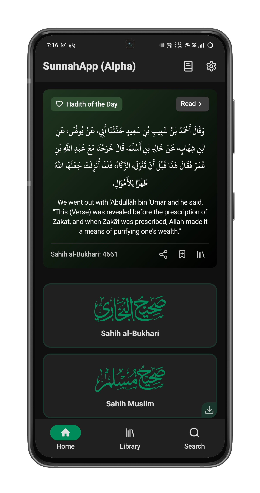
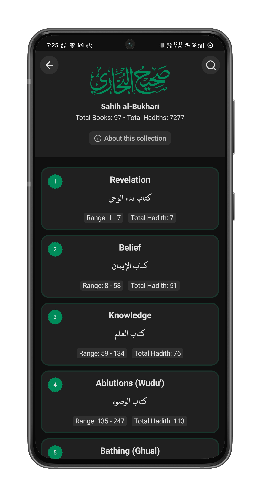
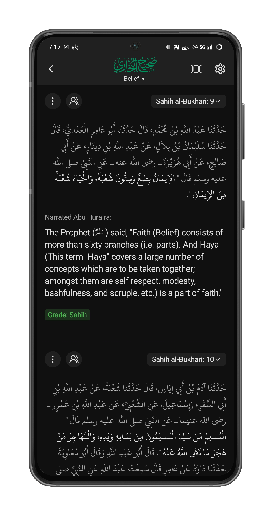
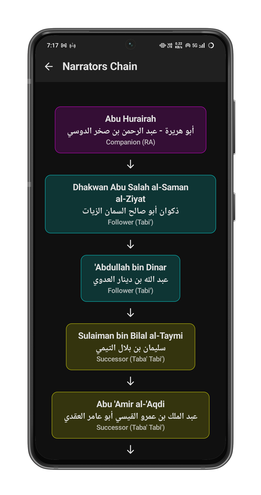
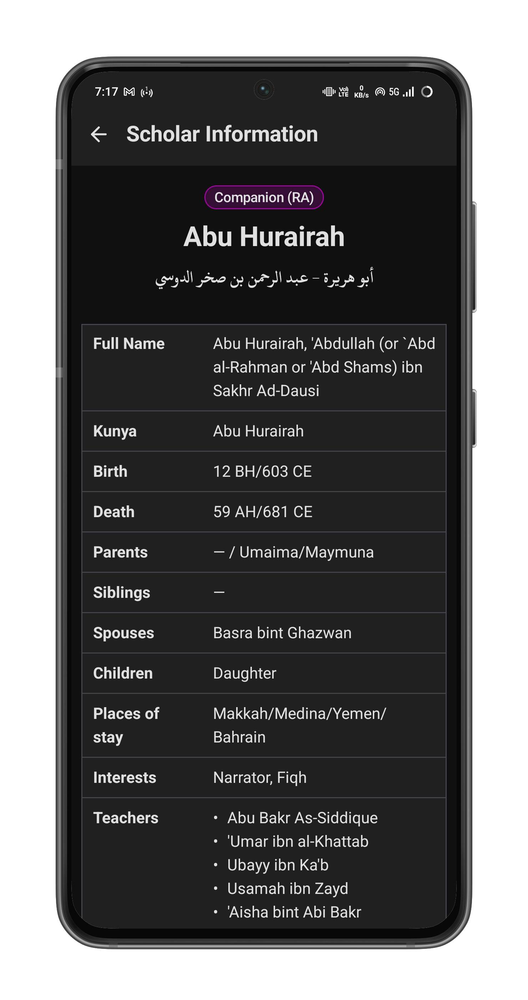
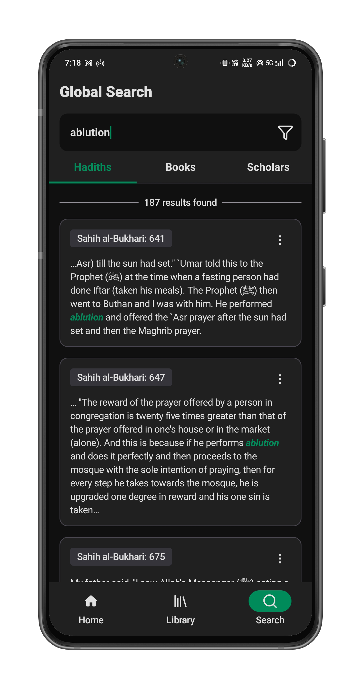
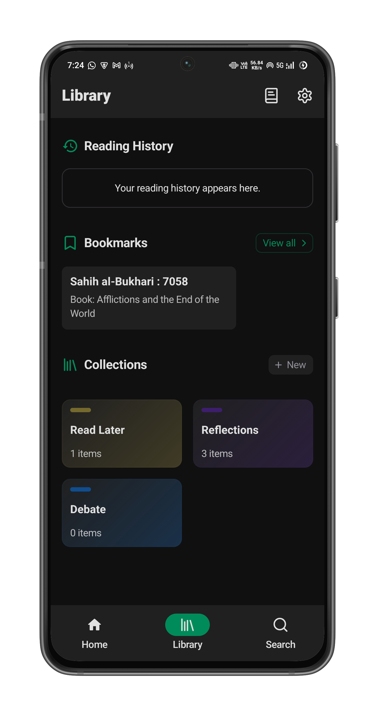
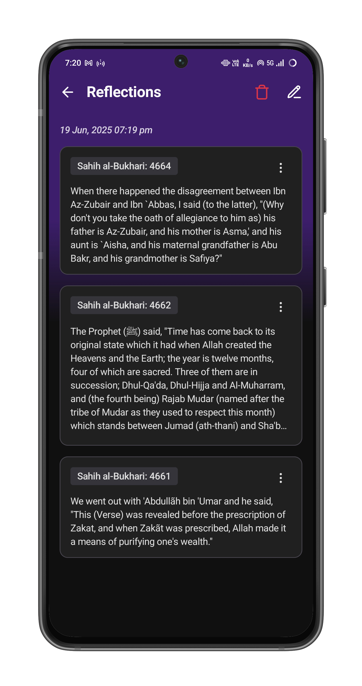
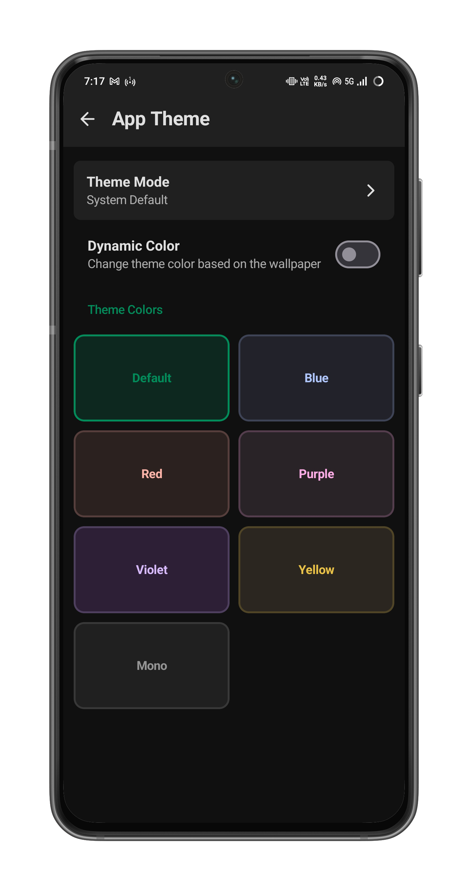

# SunnahApp
 
It is an app for exploring the Sunnah of the Prophet (peace be upon him) which is currently under development. It will have an interface similar to that of the [QuranApp](https://github.com/AlfaazPlus/QuranApp), InshaAllah.

> THIS APP IS UNDER DEVELOPMENT

      
      
      
      
      
      
      
      
      
      

 