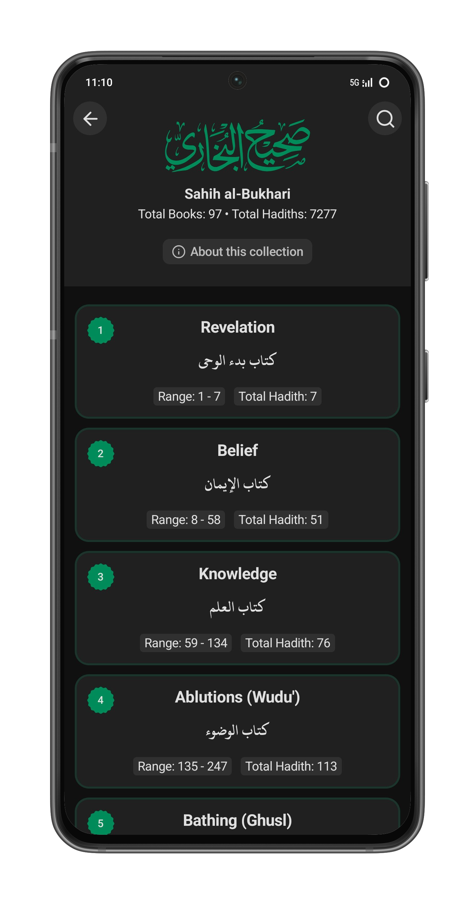

### SunnahApp

The SunnahApp is an ad-free and privacy-focused mobile application that facilitates exploring the Sunnah of the Prophet (peace be upon him).

Join the community:

Download:

> THIS APP IS UNDER DEVELOPMENT. It will be available on the Play Store soon, Insha Allah.

## Screenshots

      
      
      
      
      
      
      
      
      
      

 
